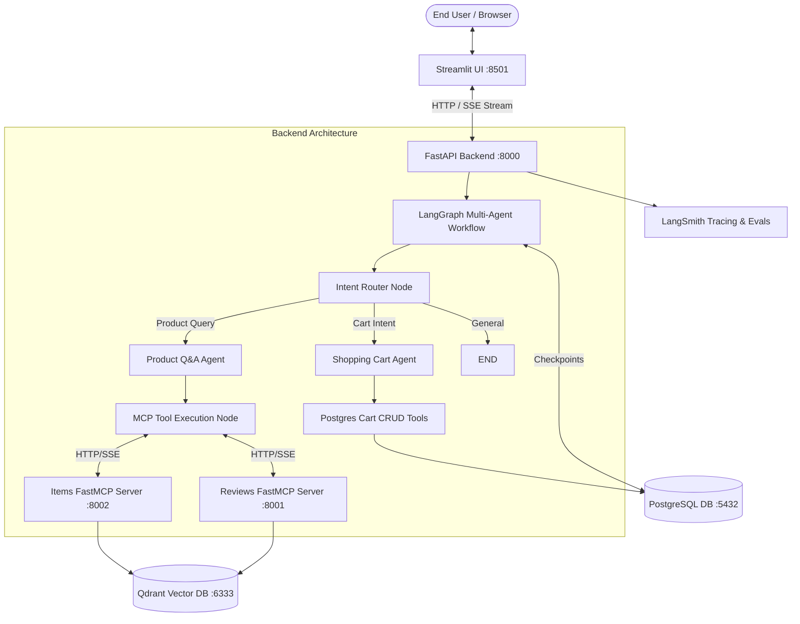

# Capstone Project — Production Solution & Code Walkthrough

## 1. Master Architecture Overview
The complete working production solution is encapsulated within the `ai-engineering-bootcamp-cohort-4-main` codebase.

## 2. Key Code Files in the Repository
1. **Multi-Agent State Graph**: [apps/api/src/api/agents/graph.py](file:///c:/Users/anurag/Desktop/notes/End_to_End_AI_Engineering_Bootcamp/scratch/repo/ai-engineering-bootcamp-cohort-4-main/apps/api/src/api/agents/graph.py)
   - Implements `StateGraph(State)` with typed state reducer `operator.add`.
   - Compiles with `PostgresSaver.from_conn_string(...)` checkpointer.
   - Generates Server-Sent Events (SSE) via `agent_stream_wrapper` yielding node lifecycle updates.
2. **Specialized Agents & Prompts**: [apps/api/src/api/agents/agents.py](file:///c:/Users/anurag/Desktop/notes/End_to_End_AI_Engineering_Bootcamp/scratch/repo/ai-engineering-bootcamp-cohort-4-main/apps/api/src/api/agents/agents.py)
   - Decoupled prompt loading from YAML registries.
   - Pydantic models for structured output generation (`RAGUsedContext`).
3. **Decoupled FastMCP Tool Servers**:
   - [apps/items_mcp_server/src/items_mcp_server/main.py](file:///c:/Users/anurag/Desktop/notes/End_to_End_AI_Engineering_Bootcamp/scratch/repo/ai-engineering-bootcamp-cohort-4-main/apps/items_mcp_server/src/items_mcp_server/main.py): Item catalog FastMCP server.
   - [apps/reviews_mcp_server/src/reviews_mcp_server/main.py](file:///c:/Users/anurag/Desktop/notes/End_to_End_AI_Engineering_Bootcamp/scratch/repo/ai-engineering-bootcamp-cohort-4-main/apps/reviews_mcp_server/src/reviews_mcp_server/main.py): Customer reviews FastMCP server.
4. **Streamlit Frontend Application**: [apps/chatbot_ui/src/chatbot_ui/app.py](file:///c:/Users/anurag/Desktop/notes/End_to_End_AI_Engineering_Bootcamp/scratch/repo/ai-engineering-bootcamp-cohort-4-main/apps/chatbot_ui/src/chatbot_ui/app.py)
   - Consumes backend SSE streaming endpoint.
   - Renders product cards with images, prices, and descriptions.
   - Synchronizes live cart contents in the UI sidebar.
   - Provides user thumbs-up/down feedback linked to LangSmith trace IDs.
5. **Multi-Service Container Orchestration**: [docker-compose.yml](file:///c:/Users/anurag/Desktop/notes/End_to_End_AI_Engineering_Bootcamp/scratch/repo/ai-engineering-bootcamp-cohort-4-main/docker-compose.yml)
   - Spans 6 containers with environment variable injection, port forwards, and persistent volume mounts.
