# Section 0 — Problem Framing, Infrastructure Setup & RAG Foundations

## What This Section Is About

This section establishes the technical, operational, and architectural bedrock of enterprise AI engineering. It transitions practitioners from ad-hoc experimentation with LLM wrappers toward disciplined, production-grade AI system design. Aurimas Griciunas introduces the complete AI Product Lifecycle—from problem scoping and dataset curation to vector indexing, baseline retrieval, generation, and observability.

Rather than treating LLMs as standalone black boxes, this module reframes them as stochastic reasoning and synthesis engines that must be grounded with external knowledge via Retrieval-Augmented Generation (RAG). Practitioners configure a containerized development environment leveraging modern tooling (UV, Docker Compose, Qdrant Vector Database, and PostgreSQL) and ingest an enterprise e-commerce dataset (Amazon Electronics category).

By the end of this sprint, students construct a functional, end-to-end baseline RAG pipeline connected across a FastAPI backend and a Streamlit user interface, instrumented with foundational tracing (LangSmith) and evaluated systematically against a synthetic reference test set using the RAGAS evaluation framework.

## Main Concepts

- **AI Product Lifecycle**: Scoping, Prototyping, Evaluation, Production Hardening, and Continuous Monitoring
- **Retrieval-Augmented Generation (RAG) Architecture**: Dense retrieval, semantic chunking, and grounded prompt synthesis
- **Vector Database Mechanics**: Embeddings, distance metrics (Cosine vs. Dot Product), and Qdrant collection management
- **Three Pillars of LLM Observability**: Tracing (spans & execution DAGs), Metrics (latency, token costs), and Logging (inputs, outputs, metadata)
- **Automated Synthetic Evaluation**: Generating golden Q&A test cases from corpus data and running automated RAGAS metrics (Faithfulness, Answer Relevance)

## Conceptual Flow

```mermaid
graph LR

    s0["Problem Framing & AI Lifecycle"] --> s1["Tooling & Environment Setup (UV, Docker, Qdrant)"]
    s1["Tooling & Environment Setup (UV, Docker, Qdrant)"] --> s2["Amazon Dataset Ingestion & Preprocessing"]
    s2["Amazon Dataset Ingestion & Preprocessing"] --> s3["Vector Embedding & Qdrant Indexing"]
    s3["Vector Embedding & Qdrant Indexing"] --> s4["Baseline RAG Retrieval & Prompt Synthesis"]
    s4["Baseline RAG Retrieval & Prompt Synthesis"] --> s5["Observability Setup (LangSmith)"]
    s5["Observability Setup (LangSmith)"] --> s6["Synthetic Golden Dataset Generation"]
    s6["Synthetic Golden Dataset Generation"] --> s7["Automated Evaluation with RAGAS"]
```

**Progression Sequence**: Problem Framing & AI Lifecycle → Tooling & Environment Setup (UV, Docker, Qdrant) → Amazon Dataset Ingestion & Preprocessing → Vector Embedding & Qdrant Indexing → Baseline RAG Retrieval & Prompt Synthesis → Observability Setup (LangSmith) → Synthetic Golden Dataset Generation → Automated Evaluation with RAGAS

## Important Lessons

### Understanding the AI Product Lifecycle

Teaches the end-to-end lifecycle of production AI applications, distinguishing research prototypes from deployable systems. It highlights iterative problem framing, metric definitions, and continuous observability as central engineering requirements. This sets the overarching discipline for the entire bootcamp.

### Tooling Overview (LangGraph, Vector DBs, LLM APIs, UV, Docker)

Surveys the modern AI engineering stack: UV for ultra-fast dependency management, Docker Compose for multi-container orchestration, Qdrant for vector indexing, and LangGraph for workflow control. It clarifies why modular, decoupled tools prevent technical debt and vendor lock-in.

### What is RAG? Conceptual Architecture & Failure Modes

Deconstructs naive vs. advanced RAG architectures, detailing how retrieval mitigates knowledge cutoff and parametric hallucinations. It analyzes common RAG failure modes (retrieval miss, hallucinated context, context overflow) and establishes why grounding is non-negotiable for enterprise applications.

### Embedding Models & Vector DB Integration

Examines vector embedding representations (e.g., OpenAI text-embedding-3-small), dimensionality, and vector index topologies. Demonstrates how to write custom ingestion scripts to serialize catalog items, generate vector payloads, and bulk-load them into Qdrant collections.

### Implementing Basic Observability Foundations

Introduces LLM-specific observability principles using LangSmith and OpenTelemetry. Explains how distributed trace IDs, nested run spans, token usage accounting, and latency telemetry enable real-time debugging and root-cause analysis for stochastic pipelines.

### Evaluating Basic End-to-End Retrieval and Generation

Addresses the evaluation bottleneck in LLM engineering by introducing the RAGAS framework. Focuses on core metrics: Faithfulness (measuring hallucinations against retrieved context), Answer Relevance (checking query-answer alignment), Context Recall, and Context Precision.

### Amazon Electronics Category Dataset Overview & Prep

Details the primary dataset powering the bootcamp capstone: the Amazon Reviews 2023 Electronics dataset. Covers schema normalization, filtering items observed from 2022 onwards, handling hierarchical categories, and cleaning item metadata for semantic retrieval.

### [OPTIONAL] AI Project Canvas & Success Metrics Frameworks

Provides executive frameworks for scoping AI products, computing ROI, identifying failure risks, and mapping operational SLAs (P95 latency, cost ceilings, precision thresholds) to system architectural decisions.

## Practical Work

- Setting up local development infrastructure with UV, Docker Compose, and environment secrets
- Preprocessing and cleaning the Amazon Electronics catalog dataset in Jupyter Notebooks
- Spinning up Qdrant in Docker, configuring collections, and batch-uploading dense vector embeddings
- Building a baseline RAG query engine using OpenAI text-embedding-3-small and GPT-4o-mini
- Connecting the RAG engine to a FastAPI backend endpoint and serving a live Streamlit UI
- Configuring LangSmith tracing to inspect prompts, retrieved documents, and token usage in real time
- Synthesizing an evaluation dataset from Qdrant payloads and running automated RAGAS evaluations

## Important Takeaways

- Naive RAG provides immediate grounding but is highly susceptible to retrieval misses and irrelevant context noise without structured context engineering.
- Observability is not an afterthought; tracing must be instrumented on day one using unified run trees and trace IDs.
- UV provides near-instantaneous, deterministic environment resolution compared to traditional pip/poetry workflows.
- Vector databases require deliberate payload design: storing parent ASINs, titles, ratings, and image URLs inside Qdrant payloads avoids expensive secondary database lookups during UI rendering.
- Synthetic data generation paired with LLM-as-a-judge frameworks (RAGAS) enables quantitative CI regression testing without relying on scarce human annotations.
- Embedding dimensions (1536 for text-embedding-3-small) and distance metrics (Cosine similarity) must remain strictly consistent across ingestion and inference.
- Docker Compose provides reproducible multi-service coordination for local development across API, vector database, and frontend containers.

## Relationship to Previous Sections

Assumes fundamental Python proficiency, familiarity with REST APIs, and basic exposure to LLM prompting.

## Relationship to Later Sections

Provides the baseline RAG pipeline and containerized infrastructure that Sprint 1 upgrades with structured outputs, hybrid dense-sparse retrieval, and cross-encoder re-ranking.

## What I Should Know After Completing This Section

- [ ] I can scaffold a production AI repository using UV, Docker Compose, and environment configurations.
- [ ] I understand the mathematical and architectural mechanics of embedding models and vector indexing in Qdrant.
- [ ] I can implement a working RAG pipeline with dense vector retrieval and prompt grounding.
- [ ] I know how to instrument LangSmith tracing across FastAPI backend routes.
- [ ] I can generate synthetic reference datasets and execute automated RAGAS evaluation runs.

