# Section 2 — Agents & Agentic Systems

## What This Section Is About

This section marks the decisive transition from linear, deterministic RAG pipelines to autonomous, tool-using agentic architectures. Rather than executing a static 'Retrieve-Then-Generate' sequence for every prompt, an agent dynamically reasons about user intent, decides whether retrieval is even necessary, formulates optimized search queries, inspects retrieved results, and determines whether additional actions or iterations are required.

Aurimas Griciunas introduces the industry-standard agentic design patterns established by Anthropic and leading research labs: Augmented LLMs, Prompt Chaining, Routing, Parallelization, Orchestrator-Workers, and Evaluator-Optimizer loops. The core technical engine used to implement these loops is LangGraph, a state-machine framework built on cyclical directed graphs.

Practitioners construct a production-ready single-turn ReAct (Reason + Act) agent. They build specialized graph nodes: an Intent Router node that filters out off-topic or conversational queries, a Query Expansion node that rewrites complex user questions into targeted search queries, an Agent Reasoning node that generates tool calls, and a Tool Execution node that executes the hybrid retrieval tool against Qdrant. The module concludes with agent memory architectures, reflection mechanisms, and trajectory-level evaluation.

## Main Concepts

- **Agent Decision Loop**: Perception, Reasoning, Tool Invocation, Observation, and Termination (ReAct Framework)
- **LangGraph Core Abstractions**: StateGraph, typed State schemas, Nodes, Directed Edges, Conditional Edges, START, and END
- **Anthropic's Agent Design Patterns**: Augmented LLM, Prompt Chaining, Routing, Parallelization, Orchestrator-Workers, and Evaluator-Optimizer
- **Tool Calling Mechanics**: Binding Pydantic schemas / JSON-schema tool specifications to LLMs and executing tool call responses
- **Query Expansion & Intent Routing**: Disambiguating complex user queries into sub-queries and filtering irrelevant queries prior to retrieval
- **Short-Term vs. Long-Term Memory**: In-graph state scratchpad vs. persistent conversation history buffers
- **Agent Trajectory Evaluation**: Measuring task completion rate, tool call accuracy, and step efficiency rather than single-turn text metrics

## Conceptual Flow

```mermaid
graph LR

    s0["Agent Architectures & Decision Loops"] --> s1["Anthropic Agentic Patterns"]
    s1["Anthropic Agentic Patterns"] --> s2["Tool Use & Schema Binding"]
    s2["Tool Use & Schema Binding"] --> s3["LangGraph StateGraph Fundamentals"]
    s3["LangGraph StateGraph Fundamentals"] --> s4["Query Expansion & Intent Routing Nodes"]
    s4["Query Expansion & Intent Routing Nodes"] --> s5["ReAct Agent Loop Construction"]
    s5["ReAct Agent Loop Construction"] --> s6["Backend Graph Compilation & Execution"]
```

**Progression Sequence**: Agent Architectures & Decision Loops → Anthropic Agentic Patterns → Tool Use & Schema Binding → LangGraph StateGraph Fundamentals → Query Expansion & Intent Routing Nodes → ReAct Agent Loop Construction → Backend Graph Compilation & Execution

## Important Lessons

### Agent Architecture and Decision Loops

Defines what constitutes an AI agent: an LLM equipped with tools, memory, and a cyclical reasoning loop that observes environment feedback to make sequential decisions toward a goal. Contrasts simple prompt chains with truly autonomous loops.

### Tool Use in Agents

Explains the mechanics of function calling and tool binding. Shows how tool arguments are serialized into JSON schemas, how LLMs decide which tool to trigger, and how execution outputs are fed back into agent message histories as ToolMessages.

### Patterns for Building Agentic Systems

Deep dives into Anthropic's landmark framework for building effective agents. Analyzes when to use simple prompt chaining vs. routing vs. parallel execution vs. orchestrator-worker patterns, cautioning against over-engineering agent autonomy when simpler patterns suffice.

### Memory in Agent Systems

Breaks down memory hierarchies in agent systems: working memory (the current state and tool observations), short-term memory (session conversation buffers), and long-term memory (external vector/relational databases for cross-session knowledge retrieval).

### Reflection & Agent Evaluation Frameworks

Presents reflection and self-correction loops where an agent evaluates its own intermediate outputs before finalizing answers. Introduces trajectory evaluation to assess whether an agent selected appropriate tools and took optimal execution paths.

## Practical Work

- Building foundational LangGraph graphs with StateGraph, typed state dictionaries, and conditional edge routing
- Implementing a Query Expansion node that takes ambiguous queries and outputs multiple parallelized search queries
- Building an Intent Router node with Pydantic structured output that categorizes inputs into product queries vs. conversational chitchat
- Wrapping the Qdrant hybrid retrieval engine into a standardized Python tool with type annotations and docstrings
- Constructing a complete ReAct loop in LangGraph connecting the intent router, agent node, and ToolNode with loopback edges
- Migrating the compiled LangGraph workflow into the FastAPI backend and exposing clean query endpoints

## Important Takeaways

- Autonomy is not all-or-nothing: the most reliable enterprise systems use deterministic routing and guardrails around constrained agent decision loops.
- LangGraph models agent workflows as explicit state machines where transitions are governed by pure Python functions and conditional edges.
- Tool definitions must have crystal-clear docstrings and type annotations; LLMs rely entirely on these descriptions to decide when and how to call tools.
- An Intent Router node prevents expensive vector database queries and LLM tool iterations for simple greetings or out-of-scope questions.
- Loopback edges allow agents to critique tool outputs and execute secondary queries if initial retrieval fails to yield relevant answers.
- State management in LangGraph requires explicit reducer functions (e.g., `operator.add`) when accumulating message histories across graph iterations.
- Never evaluate agents on output text alone; evaluation must assess the entire execution trajectory (tool selection, argument validity, iteration count).

## Relationship to Previous Sections

Builds on Sprint 1's structured outputs and hybrid retrieval engine, converting static RAG pipelines into modular tools callable by LLM agents.

## Relationship to Later Sections

Forms the foundational agent loop that Sprint 3 extends with multi-turn conversation persistence, human-in-the-loop controls, and Model Context Protocol (MCP) servers.

## What I Should Know After Completing This Section

- [ ] I can define a LangGraph StateGraph with custom state models, nodes, and conditional edges.
- [ ] I can bind tools to LLM models and handle ToolMessage loopbacks within a graph.
- [ ] I can implement an Intent Router and Query Expansion node in LangGraph.
- [ ] I understand the difference between single-turn chains, ReAct agents, and orchestrator-worker workflows.
- [ ] I can integrate a compiled LangGraph agent into a production FastAPI backend.

