# Section 3 — Moving From Basic To Agentic RAG

## What This Section Is About

This section elevates agentic architectures into full-fledged conversational enterprise systems. While Sprint 2 constructed a single-turn agent loop, real-world customer applications require stateful multi-turn dialogues, multiple heterogenous retrieval tools, human oversight, real-time streaming, and decoupled protocol standards.

Aurimas Griciunas introduces LangGraph state persistence using database checkpointers (MemorySaver and production PostgresSaver), enabling agents to retain context, user preferences, and intermediate reasoning across conversational turns partitioned by thread IDs. To handle multi-domain inquiries, a secondary Qdrant collection for Amazon Customer Reviews is introduced, providing the agent with two distinct tools: product catalog lookup and review sentiment analysis.

Crucially, this module adopts the Model Context Protocol (MCP) open standard open-sourced by Anthropic. Students decouple the retrieval tools from the core application backend, packaging them into standalone FastMCP microservices running on dedicated ports. Finally, to eliminate perceived latency during multi-step reasoning, students implement Server-Sent Events (SSE) streaming, broadcasting agent progress ('Analysing question...', 'Searching catalog...') and token streams to the frontend in real time, accompanied by human feedback mechanisms linked to LangSmith traces.

## Main Concepts

- **Multi-Turn State Persistence**: Thread IDs, LangGraph Checkpointers (MemorySaver & PostgresSaver), and state snapshots
- **Agentic Multi-Source RAG**: Equipping agents with multiple specialized tools (Item Catalog vs. User Reviews) and dynamic query dispatching
- **Model Context Protocol (MCP)**: Client-Server architecture, FastMCP, protocol transport layers (SSE / HTTP / Stdio), and tool sandboxing
- **Human-in-the-Loop (HITL)**: Workflow interruption breakpoints, human approval of tool execution, and action modification
- **Production Telemetry & Human Feedback**: Attributing thumbs-up/down ratings to LangSmith trace IDs for targeted dataset curation
- **Graph State Streaming & Server-Sent Events (SSE)**: Streaming node lifecycle events and token deltas to eliminate UI latency bottlenecks

## Conceptual Flow

```mermaid
graph LR

    s0["Single-Turn Limitations"] --> s1["LangGraph State Checkpointing (PostgresSaver)"]
    s1["LangGraph State Checkpointing (PostgresSaver)"] --> s2["Multi-Tool Expansion (Catalog + Reviews)"]
    s2["Multi-Tool Expansion (Catalog + Reviews)"] --> s3["Model Context Protocol (FastMCP Microservices)"]
    s3["Model Context Protocol (FastMCP Microservices)"] --> s4["Human Feedback & LangSmith Tracing"]
    s4["Human Feedback & LangSmith Tracing"] --> s5["Server-Sent Events (SSE) Graph Streaming"]
    s5["Server-Sent Events (SSE) Graph Streaming"] --> s6["Frontend Real-Time Rendering"]
```

**Progression Sequence**: Single-Turn Limitations → LangGraph State Checkpointing (PostgresSaver) → Multi-Tool Expansion (Catalog + Reviews) → Model Context Protocol (FastMCP Microservices) → Human Feedback & LangSmith Tracing → Server-Sent Events (SSE) Graph Streaming → Frontend Real-Time Rendering

## Important Lessons

### Agent Integrations with RAG Systems

Explores how agents transform traditional RAG from static pipelines into adaptive information gatherers. Explains how agents dynamically choose between multiple vector databases, rewrite sub-queries, and verify information completeness before replying.

### Human Feedback and Fault Tolerance in Agentic Systems

Focuses on production resilience: handling tool execution failures, API rate limits, and fallback strategies. Demonstrates how capturing explicit user feedback (thumbs up/down) directly into observability trace runs creates high-value fine-tuning and evaluation datasets.

### Human in the Loop (HITL)

Teaches patterns for human oversight in autonomous workflows. Explains how LangGraph breakpoints pause graph execution prior to sensitive tool actions (e.g., database writes, payment triggers), awaiting human confirmation or modification before proceeding.

### Model Context Protocol (MCP)

Comprehensive deep-dive into Anthropic's Model Context Protocol. Explains why decoupling tools into independent MCP servers prevents monolithic agent backends, standardizes tool discovery, and enables secure, language-agnostic tool integration.

## Practical Work

- Integrating PostgresSaver with LangGraph to persist multi-turn conversation states across browser sessions
- Indexing the Amazon Customer Reviews dataset into a dedicated Qdrant collection and creating a review retrieval tool
- Building two independent FastMCP servers: `items_mcp_server` (port 8002) and `reviews_mcp_server` (port 8001)
- Creating a custom MCP Tool Node in LangGraph that queries MCP servers over HTTP/SSE transports
- Implementing Server-Sent Events (SSE) in FastAPI to stream agent status updates ('Analysing...', 'Looking for items...') to the client
- Connecting a Streamlit frontend to the SSE stream and adding interactive thumbs-up/thumbs-down feedback widgets that log directly to LangSmith

## Important Takeaways

- Checkpointers are the foundation of conversational agents: without persistence, agents treat every user input as a blank-slate interaction.
- Thread IDs partition conversational states in PostgresSaver, allowing thousands of concurrent users to maintain independent memory contexts.
- Model Context Protocol (MCP) represents the future of tool integration: tools become standardized microservices rather than tightly coupled Python imports.
- FastMCP makes spinning up production MCP servers with SSE transports possible in less than 30 lines of code.
- Streaming agent state transitions dramatically improves perceived latency: users see intermediate progress rather than staring at a frozen spinner for 10 seconds.
- Human-in-the-loop breakpoints allow enterprises to safely adopt autonomous agents by requiring human sign-off on irreversible or high-impact actions.
- Linking user feedback directly to LangSmith trace IDs enables engineers to immediately filter for failed runs and triage retrieval or prompt flaws.

## Relationship to Previous Sections

Builds on Sprint 2's LangGraph StateGraph and tool-calling foundations, extending them with persistence, MCP, and streaming.

## Relationship to Later Sections

Provides the persistent state management and decoupled tool infrastructure that Sprint 4 expands into Multi-Agent Systems.

## What I Should Know After Completing This Section

- [ ] I can configure PostgresSaver to persist multi-turn conversational state in LangGraph.
- [ ] I can build and run independent FastMCP tool servers.
- [ ] I can connect a LangGraph agent to remote MCP servers over HTTP transport.
- [ ] I can implement Server-Sent Events (SSE) streaming for agent status and responses.
- [ ] I can collect user feedback in a frontend UI and attribute it to backend LangSmith traces.

