# Section 4 — Multi-Agent Systems

## What This Section Is About

This section explores the architectural frontier of enterprise AI: Multi-Agent Systems (MAS). As agent capabilities expand, overloading a single agent with dozens of disparate tools, conflicting instructions, and sprawling context windows invariably degrades reliability, increases hallucination rates, and exhausts token budgets.

Aurimas Griciunas demonstrates how to decompose complex domains into modular, specialized agents that collaborate within an orchestrated topology. In the context of the e-commerce capstone, this involves separating concerns into dedicated agents: a Coordinator (Supervisor) Agent that handles multi-step planning and routing, a Product Q&A Agent specialized in hybrid catalog and review retrieval, and a Shopping Cart Agent equipped with direct database CRUD operations (Add, View, Remove items) in PostgreSQL.

Students master foundational multi-agent communication protocols (A2A), state synchronization, memory sharing, and hierarchical supervision. The resulting architecture allows a user to ask complex questions, inspect product reviews, add selected items to their cart, and observe their cart updated live in the user interface—all coordinated seamlessly through a LangGraph multi-agent state graph.

## Main Concepts

- **Why Multi-Agent Systems (MAS)**: Overcoming single-agent context pollution, tool overload, and instruction drift through specialization
- **Multi-Agent Topologies**: Hierarchical / Supervisor-Worker pattern vs. Peer-to-Peer / Network collaboration vs. Router-Specialist pattern
- **Coordinator / Supervisor Agent Pattern**: Dynamic task decomposition, sub-task delegation, and plan re-evaluation based on worker feedback
- **State Synchronization & Memory Sharing**: Shared graph state vs. encapsulated agent private scratchpads
- **Agent-to-Agent (A2A) Communication Protocols**: Standardized JSON envelopes, intent handoffs, and return-to-supervisor routing
- **Transactional Database Tooling**: Equipping specialized agents with transactional SQL tools for stateful CRUD operations

## Conceptual Flow

```mermaid
graph LR

    s0["Single-Agent Bottlenecks"] --> s1["MAS Principles & Topologies"]
    s1["MAS Principles & Topologies"] --> s2["Shopping Cart Database Schema & Tools"]
    s2["Shopping Cart Database Schema & Tools"] --> s3["Shopping Cart Specialist Agent"]
    s3["Shopping Cart Specialist Agent"] --> s4["Coordinator / Supervisor Agent Design"]
    s4["Coordinator / Supervisor Agent Design"] --> s5["Multi-Agent LangGraph Orchestration"]
    s5["Multi-Agent LangGraph Orchestration"] --> s6["Real-Time Frontend Cart Synchronization"]
```

**Progression Sequence**: Single-Agent Bottlenecks → MAS Principles & Topologies → Shopping Cart Database Schema & Tools → Shopping Cart Specialist Agent → Coordinator / Supervisor Agent Design → Multi-Agent LangGraph Orchestration → Real-Time Frontend Cart Synchronization

## Important Lessons

### Multi-Agent Systems and When to Use Them

Establishes a rigorous decision framework for multi-agent adoption. Contrasts single-agent architectures with MAS, demonstrating that MAS introduces communication latency and orchestration complexity, and should only be adopted when domains exhibit distinct tool boundaries and conflicting prompt instructions.

### Planning, Delegation, and Task Routing Among Agents

Focuses on the Coordinator / Supervisor design pattern. Teaches how a top-level planner breaks down a user prompt into sequential or parallel steps, delegates execution to specialist agents, and synthesizes worker outputs into a cohesive response.

### Synchronization and Memory Sharing

Analyzes state management across multi-agent workflows. Details how to structure shared graph state dictionaries so worker agents can read global context without inadvertently overwriting other agents' private execution logs.

### Agent-to-Agent Communication Protocols (A2A)

Explores standardized protocols for inter-agent messaging. Examines message envelopes, structured JSON payloads, authentication, and execution handoffs, preparing systems for distributed, multi-framework agent collaboration.

## Practical Work

- Creating PostgreSQL tables for user shopping carts (`cart_id`, `user_id`, `asin`, `quantity`, `added_at`)
- Implementing three transactional Python tools: `add_to_cart`, `get_cart_contents`, and `remove_from_cart`
- Building a specialized Shopping Cart Agent in LangGraph equipped exclusively with cart database tools
- Designing a Coordinator Agent that plans multi-step workflows, routes queries, and tracks execution milestones
- Integrating Coordinator, Shopping Cart Agent, and Product Q&A Agent into a unified LangGraph workflow
- Extending the Streamlit frontend to display real-time shopping cart contents dynamically updated as the agent executes actions

## Important Takeaways

- Do not adopt multi-agent systems prematurely: single agents with well-scoped tools are faster, cheaper, and easier to debug.
- Adopt MAS when distinct tasks require incompatible system prompts, mutually exclusive tool sets, or isolated context windows.
- The Supervisor pattern provides the highest enterprise reliability: workers execute bounded sub-tasks and return control to the supervisor rather than engaging in unbounded peer-to-peer dialogues.
- Shared state in LangGraph allows the Coordinator to pass user IDs and session parameters seamlessly down to specialized workers.
- Tool segregation reduces hallucination: the Shopping Cart agent cannot accidentally invoke retrieval tools, and the Q&A agent cannot touch database tables.
- Agent-to-Agent handoffs must be deterministic: worker completion signals should route directly back to the coordinator node.
- Real-time UI synchronization (e.g., cart widgets updating automatically upon agent tool execution) bridges conversational AI with deterministic software applications.

## Relationship to Previous Sections

Builds on Sprint 3's persistent LangGraph checkpointers, MCP tools, and SSE streaming infrastructure.

## Relationship to Later Sections

Provides the complete multi-agent application that Sprint 5 hardens for cloud deployment, reliability fallbacks, and CI/CD testing.

## What I Should Know After Completing This Section

- [ ] I understand the trade-offs between single-agent and multi-agent system architectures.
- [ ] I can design and implement a Supervisor / Coordinator agent pattern in LangGraph.
- [ ] I can implement specialized agents with transactional database tools.
- [ ] I can manage shared vs. private state across multiple collaborating agents.
- [ ] I can synchronize multi-agent tool execution with real-time UI components.

