# Section 5 — Deployment, Optimization and Reliability

## What This Section Is About

This culminating section transforms the developed multi-agent e-commerce application into an enterprise-ready, resilient, and cost-optimized production system. Building sophisticated AI prototypes is straightforward; keeping them reliable, fast, secure, and financially viable under real-world traffic is the true challenge of AI Engineering.

Aurimas Griciunas covers production deployment architectures, containerization strategies using multi-stage Docker builds, and orchestration via Docker Compose. Latency and cost optimization are addressed systematically through OpenAI prompt caching mechanics and model fallback cascading using the LiteLLM Router. If a primary frontier model experiences rate limits, outages, or excessive latency, LiteLLM automatically fails over to secondary models without breaking active user sessions.

Furthermore, students explore modern open agent protocols, specifically Google's Agent Development Kit (ADK) and remote Agent-to-Agent (`a2a-sdk`) servers. The module concludes with security hardening (prompt injection defenses, least-privilege tool sandboxing), automated CI/CD evaluation pipelines, and capstone project demonstrations.

## Main Concepts

- **Production Deployment Architecture**: Multi-container orchestration, stateless FastAPI instances, connection pooling, and health checks
- **Model Fallback Routing with LiteLLM Router**: Automated cascading across model providers to guarantee 99.9% uptime during outages
- **Latency & Cost Engineering**: Prompt caching mechanics (prefix alignment, minimum token thresholds), speculative decoding, and SSE streaming
- **AI Security & Guardrails**: Defense against prompt injection, data exfiltration, unauthorized tool calls, and input/output guardrails
- **Agent Development Kit (ADK) & Remote A2A Servers**: Building interoperable, framework-agnostic agent microservices with `a2a-sdk`
- **Continuous Integration (CI) for AI Systems**: Automated evaluation gates, regression testing with golden datasets, and Docker build workflows

## Conceptual Flow

```mermaid
graph LR

    s0["Deployment Architectures & Containerization"] --> s1["Model Fallbacks with LiteLLM Router"]
    s1["Model Fallbacks with LiteLLM Router"] --> s2["Cost Optimization & Prompt Caching"]
    s2["Cost Optimization & Prompt Caching"] --> s3["Security Hardening & Guardrails"]
    s3["Security Hardening & Guardrails"] --> s4["Google ADK & Remote A2A Servers"]
    s4["Google ADK & Remote A2A Servers"] --> s5["Automated CI/CD Testing Pipelines"]
    s5["Automated CI/CD Testing Pipelines"] --> s6["Capstone Project Demo Day"]
```

**Progression Sequence**: Deployment Architectures & Containerization → Model Fallbacks with LiteLLM Router → Cost Optimization & Prompt Caching → Security Hardening & Guardrails → Google ADK & Remote A2A Servers → Automated CI/CD Testing Pipelines → Capstone Project Demo Day

## Important Lessons

### Deployment Architecture Patterns for AI Systems

Compares deployment topologies: monolithic vs. microservices, synchronous REST APIs vs. asynchronous worker queues (Celery/Redis), and edge vs. centralized inference. Emphasizes maintaining stateless application servers with external state in Postgres and Qdrant.

### Managing Latency and Cost for AI Applications

Provides mathematical breakdowns of LLM cost structures. Analyzes OpenAI prompt caching mechanics, explaining how prefix structure dictates cache hits (yielding 50-80% cost and latency reductions), and details model fallback routing using LiteLLM.

### Securing AI Systems

Covers critical security vulnerabilities in LLM applications: direct/indirect prompt injection, SSRF via tools, SQL injection through agents, and sensitive data leakage. Explains defense-in-depth principles and runtime guardrails.

### CI/CD for AI Applications

Establishes CI/CD workflows tailored to stochastic systems. Demonstrates how to run headless automated evaluation suites (retriever precision, RAGAS faithfulness) on pull requests to prevent regressions prior to container image deployment.

## Practical Work

- Writing production multi-stage Dockerfiles for FastAPI backend and Streamlit frontend services
- Configuring `docker-compose.yml` to orchestrate 6 services: Streamlit, FastAPI, Postgres, Qdrant, and 2 FastMCP servers
- Implementing LiteLLM Router in Python to configure fallback chains (e.g., GPT-4o → Claude-3-5-Sonnet → Gemini-1.5-Pro)
- Auditing prompt templates to ensure static prefixes maximize provider prompt cache hit rates
- Refactoring the Warehouse / Catalog Agent into an independent Google ADK agent and testing via ADK Web Server
- Implementing a remote A2A server using `a2a-sdk` and connecting the LangGraph graph over network sockets
- Packaging and presenting the complete end-to-end Capstone AI Product on Demo Day

## Important Takeaways

- Stateless application tier design is mandatory: all agent session state must reside in checkpointers (Postgres), and all vector indices in dedicated DBs (Qdrant).
- Frontier model APIs experience frequent transient rate limits; a fallback router (LiteLLM) is required for production enterprise SLAs.
- Prompt caching requires disciplined prompt engineering: dynamic variables (user query, timestamps) must be placed strictly at the end of prompts, keeping static instructions at the front.
- FastMCP microservices isolate third-party integrations, preventing compromised tools from gaining access to application host filesystems.
- Automated CI evaluation suites prevent quality regressions: code changes must prove retriever recall and generation faithfulness before deployment.
- Remote A2A protocols allow cross-organizational and cross-framework agent collaboration without code-level coupling.
- Production AI engineering requires equal parts software engineering rigor, distributed systems architecture, and prompt optimization.

## Relationship to Previous Sections

Builds upon all preceding sprints, packaging the multi-agent RAG application into a fully deployable, reliable, and observable production system.

## Relationship to Later Sections

Represents the culmination of the bootcamp curriculum, preparing engineers to architect and operate mission-critical AI products in enterprise environments.

## What I Should Know After Completing This Section

- [ ] I can containerize multi-service AI applications using Docker and Docker Compose.
- [ ] I can implement model fallback chains using LiteLLM Router to guarantee uptime.
- [ ] I know how to structure prompts to optimize for LLM provider prompt caching.
- [ ] I can implement security guardrails to protect against prompt injection and tool abuse.
- [ ] I can build and connect remote agents using the `a2a-sdk` protocol.
- [ ] I can configure automated evaluation testing gates in CI/CD pipelines.

